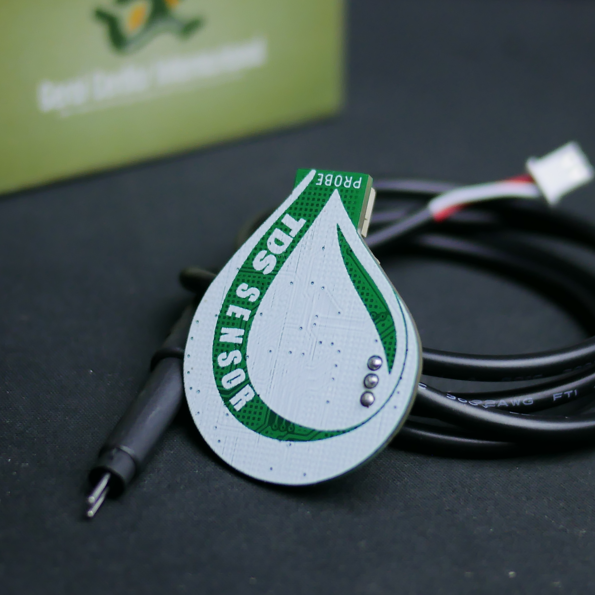

# tds-module

This design file is based on DFRobot product :
https://www.dfrobot.com/product-1662.html

Also the library and sample codes can refer to their documentation :
https://wiki.dfrobot.com/Gravity__Analog_TDS_Sensor___Meter_For_Arduino_SKU__SEN0244

